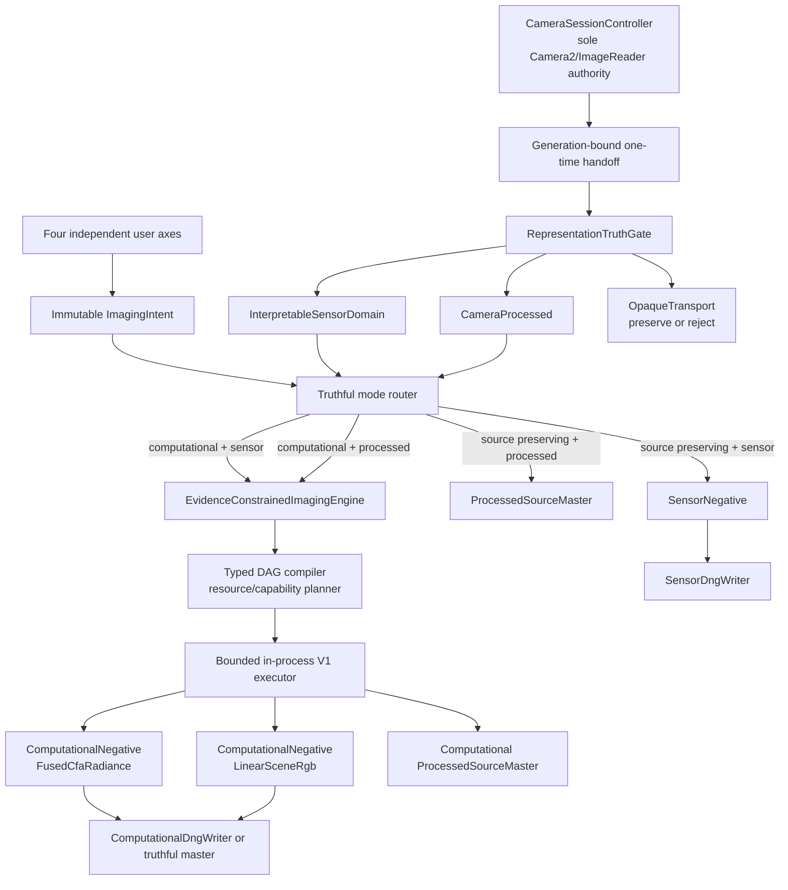

# Computational RAW Architecture — Revision 2 Freeze

Status: Accepted — M0 semantic freeze

Baseline source: `sahid-code404/CamX` / `phase/camx-108-one-shot-raw` / `75f56063cd34f802fe1e404574b496412ba3955c`

CamX2 preserves the accepted CAMX-108 camera foundation and layers the computational imaging architecture on top. M0 is intentionally architecture-, contract-, and test-specification-only. It does not replace the working preview, AUX-lens discovery, topology, one-shot RAW, OTA, cache, diagnostics, or resource-ownership paths, and it does not create a second camera owner.

## Truth contract

The strongest portable claim available to CamX is **public, interpretable sensor-domain samples with no CamX sample-changing processing**. Public Android RAW does not prove that a sensor or HAL performed no binning, remosaic, defect correction, black-level handling, shading correction, or other undocumented sensor-domain work.

The following products are distinct and may never be relabeled into one another:

- `SensorNegative<S : InterpretableSensorDomain>` — source-preserving public sensor-domain evidence; no CamX sample-changing node may have run.
- `ComputationalNegative<S : InterpretableSensorDomain, P>` — reconstructed from interpretable sensor-domain evidence, with `P = FusedCfaRadiance | LinearSceneRgb`.
- `ProcessedSourceMaster<S : CameraProcessed, P>` — source or computational product whose provenance begins with Camera-processed P010/YUV evidence.
- `OpaqueTransport` — implementation-dependent or unreadable transport tokens. Preserve or reject; never guess-decode them into the scientific engine.

`RAW_PRIVATE` is not a universal RAW fallback. P010/YUV are processed camera outputs and can never be presented as Sensor RAW or Computational RAW.

## Sole ownership boundary

`CameraSessionController` remains the only Camera2 device/session/output authority. Camera callbacks may validate permits and transfer one bounded, generation-bound lease; they perform no scientific processing, compression, DNG I/O, or long storage work.

After handoff, capture identity is immutable historical truth. A later UI lens switch, topology refresh, route failover, surface replacement, or generation change cannot rewrite a captured frame's identity.

## One scientific engine

Photo and video computational modes share one `EvidenceConstrainedImagingEngine`. They differ in acquisition policy, temporal window, deadlines, backpressure, persistence, and container policy, not in the mathematical foundation.

## Frozen user axes

The user model is four independent axes. An `AUTO` convenience may choose a recipe or backend, but it cannot silently change source policy.

| Axis | Values | Meaning |
| --- | --- | --- |
| `ReconstructionIntent` | `SOURCE_PRESERVING`, `COMPUTATIONAL` | Preserve samples or reconstruct from evidence |
| `SourcePolicy` | `SENSOR_DOMAIN_REQUIRED`, `BEST_PUBLIC_SOURCE` | Whether a processed-source fallback is permitted |
| `VideoExecution` | `MAXIMUM_QUALITY_DEFERRED`, `REALTIME_CAUSAL` | Offline/bidirectional versus bounded causal work |
| `SourceRetention` | `KEEP_SOURCE`, `DELETE_AFTER_VERIFIED_OUTPUT` | Source lifetime after a committed, reopened, verified output |

The UI must disclose requested mode separately from the resolved source/product truth.

## Frozen computational-negative semantics

`FusedCfaRadiance` is legal only when the output remains a genuine 1× CFA grid for one physical sensor/mode/color basis and no joint demosaic, super-resolution, or geometry-changing reconstruction occurred. It is computational CFA, not untouched RAW.

`LinearSceneRgb` is mandatory after joint demosaic, super-resolution, rolling-shutter geometry reconstruction, full-color reconstruction, or compatible mode reconciliation. Reconstructed RGB is never remosaiced merely to look RAW.

## Typed DAG and execution contract

Every graph edge carries representation, encoding/photometric domain, dimensions/valid area/strides, calibration/color identity, capture/temporal identity, uncertainty semantics, and memory domain/lifetime. Every node declares exact input/output types, algorithm/schema version, prerequisites, deterministic/numerical contract, spatial/temporal halo, legal precision, backends, memory formula/workspace, latency class, fallbacks, and whether it changes samples, geometry, representation, or provenance.

Illegal representation, calibration, causality, precision, memory, queue, deadline, storage, or resource plans fail before capture.

V1 compute is foreground lifecycle-scoped, bounded, and in-process:

`PLANNED -> ADMITTED -> ACQUIRING -> INGESTED_OR_DURABLE -> EXECUTING -> WRITING -> VERIFYING -> COMMITTED`

`CANCELLED` and `FAILED` deterministically release owned resources. The compute state machine is separate from the camera state machine.

## Resource and fallback contract

Worst-case reservation precedes acquisition. Source slots, queue entries, native buffers, output bytes, graph workspace, writer state, and codec/container workspace are bounded. OOM probing and unbounded frame stacks are forbidden.

Fallback dimensions are independent:

- source representation;
- cadence/stream combination;
- algorithm tier;
- backend/provider;
- storage codec/container behavior.

Crossing one fallback dimension cannot mutate trust in another. A thermal or backend failure cannot silently turn a sensor-domain product into YUV.

## DNG and RAW-video boundaries

`SensorDngWriter` and `ComputationalDngWriter` are separate contracts. CFA DNG is legal only for genuine mosaic/CFA semantics. Linear DNG carries `LinearSceneRgb` without CFA tags. P010/YUV-derived products are never disguised as DNG RAW. DNG validity and decoder interoperability are separate gates.

`RawVideoContainerContract` is frozen; MCAP/CXRB is only an M2A candidate. `RawVideoCodecContract` and reversible `PACKED_NONE` are frozen; every compressed codec is provisional until M2B evidence. Admission must always reserve a viable uncompressed reversible path.

## Decision states

### FROZEN

- sole `CameraSessionController` ownership and immutable generation-bound handoff;
- representation truth and product hierarchy;
- one canonical optical lens per reconstruction;
- one shared scientific photo/video engine with Sensor bypass;
- `FusedCfaRadiance` versus `LinearSceneRgb` semantics;
- typed DAG/resource compiler and deterministic scalar reference behavior;
- explicit measurement, alignment, visibility/occlusion, calibrated noise, and uncertainty contracts;
- bounded admission, pools, queues, backpressure, and cancellation;
- verified retention transaction and manifest/provenance requirements;
- split DNG contracts;
- `RawVideoContainerContract`;
- `RawVideoCodecContract` and mandatory `PACKED_NONE`;
- exact-profile certification and truth-preserving failure isolation;
- optional, measurement-constrained AI;
- no artistic rendering inside negative production;
- bounded, lifecycle-scoped, in-process V1 compute.

### PROVISIONAL / MUST PROVE

- MCAP-based CXRB;
- JPEG-LS or any compressed RAW-video codec;
- exact computational DNG writer implementation;
- DngCreator admission beyond proven sensor-domain cases;
- SIMD/Vulkan providers;
- direct AHardwareBuffer ingest;
- segment/tile/checkpoint dimensions and advanced precision profiles;
- separate compute process and background execution mechanism;
- all physical claims about actual sensor interpretation, sustained cadence, storage durability, timebase mapping, quality, energy, thermals, and external-decoder behavior.

## M0 completion condition

M0 is complete only when the semantic ADRs, contracts, prototype-decision registry, roadmap, and architecture guard are present and consistent, while production camera behavior remains unchanged. Implementation starts at M1 and advances only through the dependency-ordered gates in `IMPLEMENTATION_ROADMAP.md`.
